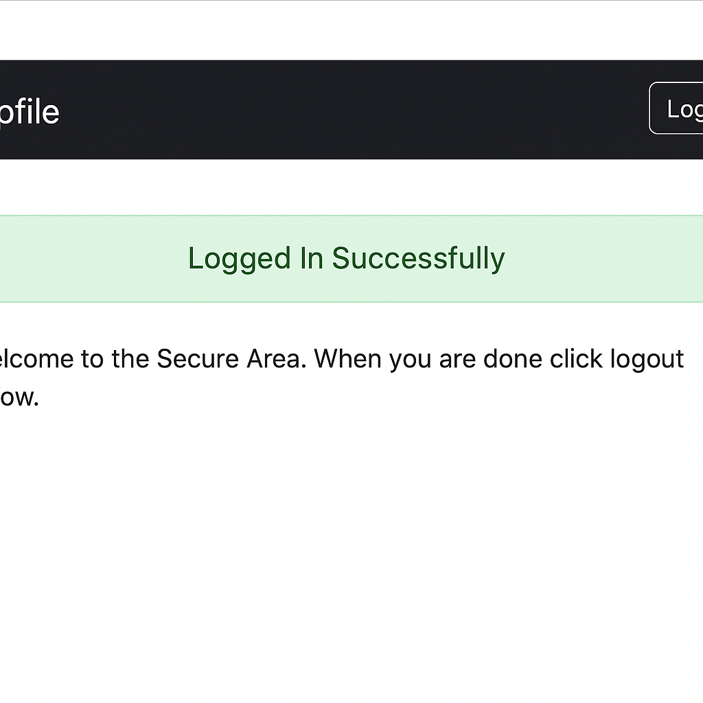

# Bug - Login aceita qualquer senha

- **Título**: Login permite acesso com qualquer senha válida
- **ID**: BUG001
- **Data**: 27/06/2025
- **Ambiente**: Produção
- **Sistema**: Practice Test Automation
- **Severidade**: Alta
- **Prioridade**: Alta
- **Status**: Aberto

---

## Descrição

Ao realizar o login com o usuário correto (`student`), o sistema permite o acesso mesmo com qualquer senha diferente da senha válida.

---

## Passos para reprodução

1. Acessar [https://practicetestautomation.com/practice-test-login/](https://practicetestautomation.com/practice-test-login/)
2. Preencher o campo **username** com `student`
3. Preencher o campo **password** com `teste123` (senha inválida)
4. Clicar no botão **Submit**

---

## Resultado Esperado

Mensagem de erro informando que a senha está incorreta.

---

## Resultado Obtido

Usuário é redirecionado para a tela de perfil, como se o login fosse bem-sucedido.

---

## Evidência

